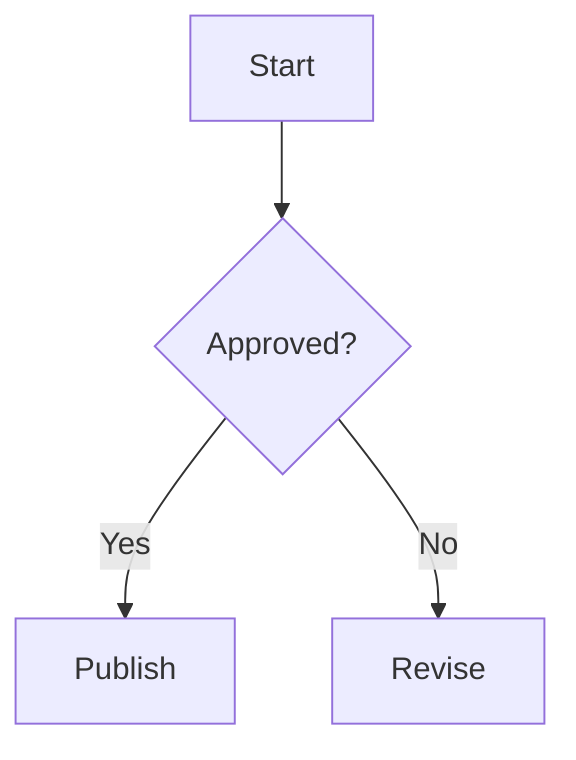

# Andocs Markdown rendering

Use ordinary Markdown for headings, tables, task lists, links, and fenced code. Start a document with `# Title`; keep heading levels in order. Relative `.md` links navigate within Andocs, while external links open a new tab. A relative link to a synced prototype `.html` file opens that page in a new tab.

| Content          | Syntax                                             | Andocs behavior                                           |
| ---------------- | -------------------------------------------------- | --------------------------------------------------------- |
| Code             | Fenced block with a language, such as `typescript` | Syntax highlighting                                       |
| Mermaid          | `mermaid` fence                                    | Zoom, pan, fullscreen                                     |
| BPMN             | `bpmn` fence or `bpmn path=...`                    | Zoom, pan, fullscreen                                     |
| Block math       | `$$ ... $$`                                        | KaTeX; inline `$...$` is unavailable                      |
| Interactive HTML | `html-preview` fence                               | Sandboxed iframe with copy, open, and fullscreen controls |

## Diagrams

Use Mermaid when it can express the diagram. Supported types include flowchart, sequenceDiagram, erDiagram, pie, gitGraph, gantt, classDiagram, and stateDiagram-v2.

````markdown

````

For BPMN, use valid BPMN 2.0 XML with diagram layout data. A referenced file works well for a diagram maintained in a BPMN editor:

````markdown
```bpmn path=diagrams/onboarding.bpmn

```
````

For a self-contained diagram, put the XML inside a `bpmn` fence. The source file must exist for the `path=` form.

## Math

```markdown
$$
x = \frac{-b \pm \sqrt{b^2 - 4ac}}{2a}
$$
```

## Interactive HTML

Use `html-preview` for HTML that should run inside the document:

````markdown
```html-preview
<button onclick="this.textContent = 'Clicked'">Click me</button>
```
````

The iframe supports HTML, CSS, JavaScript, and external CDNs. Its height adjusts within 200–800 px. If dynamic content needs explicit height reporting, post `html-preview-height` to the parent:

```js
window.parent.postMessage(
  { type: "html-preview-height", height: document.documentElement.scrollHeight },
  "*",
);
```

For a full HTML page that lives in the repository, use a [`prototype` block](prototypes.md) instead.
