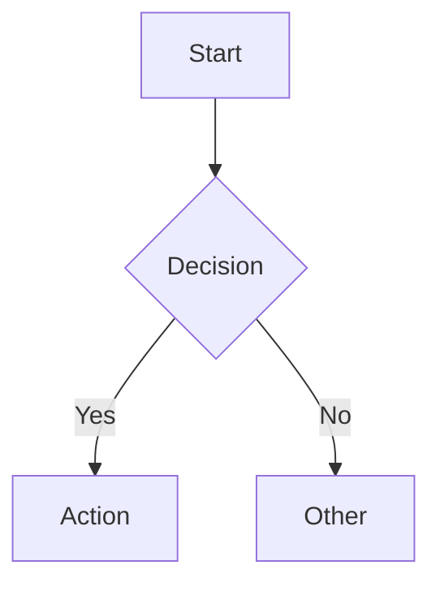
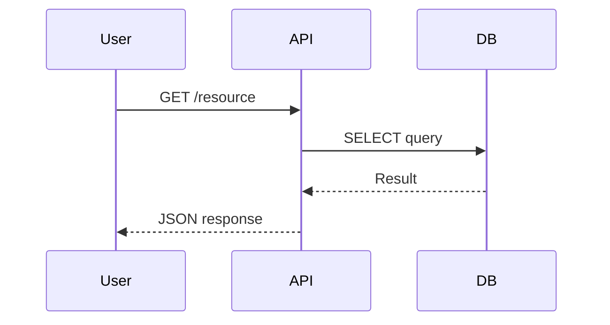
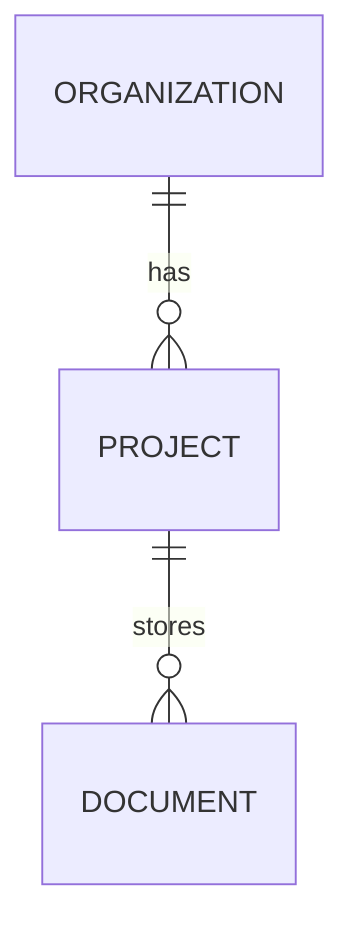
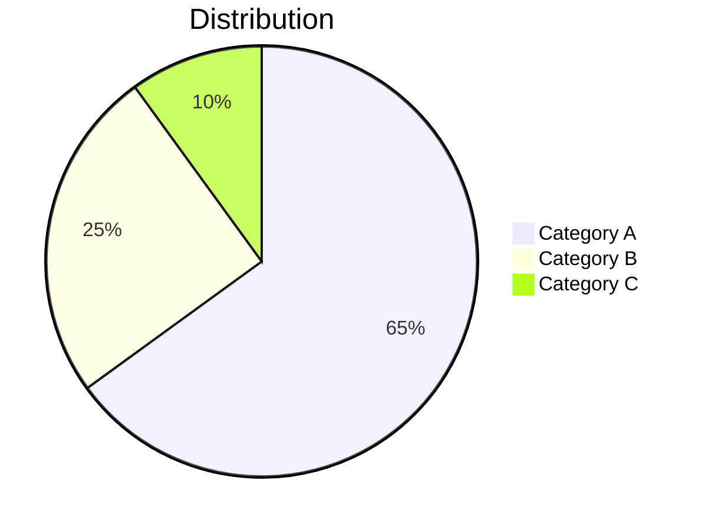

Write documentation using Andocs rendering capabilities. All features work out of the box.

## Prerequisites — Bun & Local Server

Andocs CLI requires the **Bun** runtime. Before writing docs, ensure the user has Bun installed and the local server running.

### 1. Check if Bun is installed

```bash
command -v bun
```

### 2. If Bun is NOT installed — install it

**macOS/Linux:**
```bash
curl -fsSL https://bun.sh/install | bash
```

**Windows PowerShell:**
```powershell
powershell -c "irm bun.sh/install.ps1 | iex"
```

### 3. Start the local andocs server

The user MUST have the andocs server running to preview documentation. **Start it in the background** so it doesn't block the terminal:

```bash
bunx andocs &
```

This starts a local server at **http://localhost:3030** (default). The browser opens automatically.

**Full help:** `bunx andocs -h`

**Custom port/path:**
```bash
bunx andocs --port 8080 --path ./my-docs &
```

**If the server is already running, skip this step.** Inform the user: *"andocs server is running — open http://localhost:3030 to preview your docs."*

## Code Blocks

Fenced with language identifier. 100+ languages supported (TypeScript, Python, SQL, YAML, Bash, etc.).

````markdown
```typescript
const config = yield* ConfigService;
```
````

## Mermaid Diagrams

Use `mermaid` language identifier. Renders with zoom, pan, fullscreen.

**Supported types:** flowchart, sequenceDiagram, erDiagram, pie, gitGraph, gantt, classDiagram, stateDiagram-v2

````markdown

````

````markdown

````

````markdown

````

````markdown

````

## Math / LaTeX

Block equations via KaTeX with `$$` delimiters. **Inline `$...$` is NOT enabled.**

```markdown
$$
x = \frac{-b \pm \sqrt{b^2 - 4ac}}{2a}
$$
```

Common patterns: `\frac{}{}`, `\sum_{i=1}^{n}`, `\int_{a}^{b}`, `\sqrt{}`, `\begin{bmatrix}...\end{bmatrix}`

## HTML Preview Blocks

Use `html-preview` language identifier for interactive HTML in sandboxed iframes.

````markdown
```html-preview
<div style="padding: 20px; font-family: sans-serif;">
  <h2>Interactive Demo</h2>
  <button onclick="alert('Hello!')">Click me</button>
</div>
```
````

Capabilities: full HTML/CSS/JS, external CDNs, auto-height (200–800px), toolbar (copy/open/fullscreen).

For auto-resize, add to your script:
```javascript
function postHeight() {
  window.parent.postMessage({ type: 'html-preview-height', height: document.documentElement.scrollHeight }, '*');
}
postHeight();
new MutationObserver(postHeight).observe(document.body, { childList: true, subtree: true, attributes: true });
```

## Tables

Standard markdown with alignment:

```markdown
| Left | Center | Right |
|:-----|:------:|------:|
| text | text   | text  |
```

## Task Lists

```markdown
- [x] Completed
- [ ] Pending
```

## Links

- External: `[GitHub](https://github.com)` — opens new tab
- Relative: `[Auth docs](./auth.md)` — in-app navigation
- Anchor: `[Section](#heading-id)` — smooth scroll

## Frontmatter

YAML metadata stripped from output:

```markdown
---
title: My Document
description: Summary
---
```

## Rules

- Start with `# Title` — becomes sidebar entry
- Use headings hierarchically (don't skip h1 → h3)
- Keep code blocks short — show relevant snippet only
- Use Mermaid instead of image diagrams when possible
- Use `html-preview` for interactive content, not raw HTML
- One topic per document — prefer focused docs over giant files
- Use relative `.md` links between docs for in-app navigation

## Anti-Patterns

- Don't use raw HTML instead of markdown (use `html-preview` blocks for interactive content)
- Don't create diagrams as images when Mermaid can express them
- Don't use deeply nested headings (h5, h6) — restructure into separate documents instead
