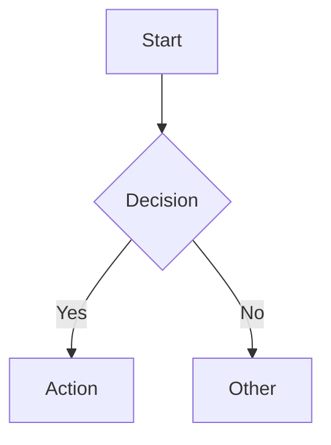
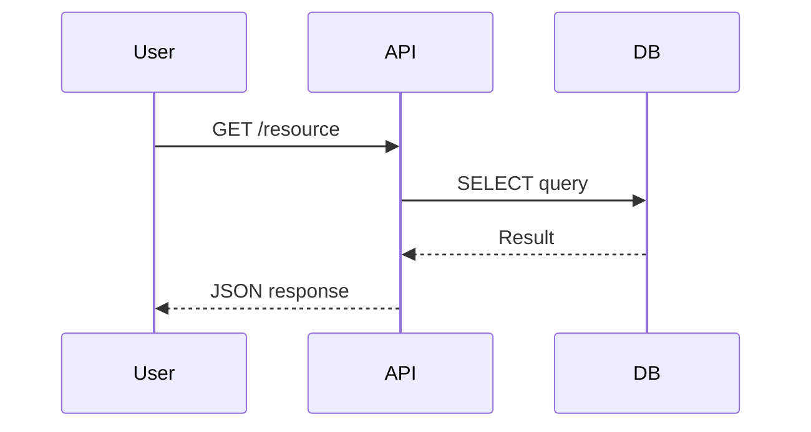
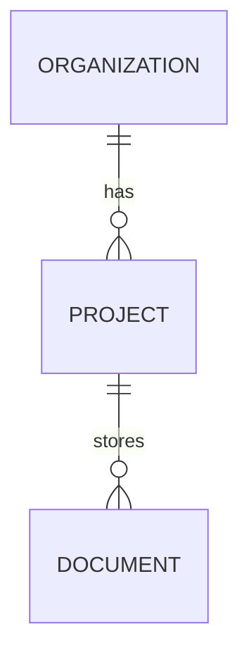
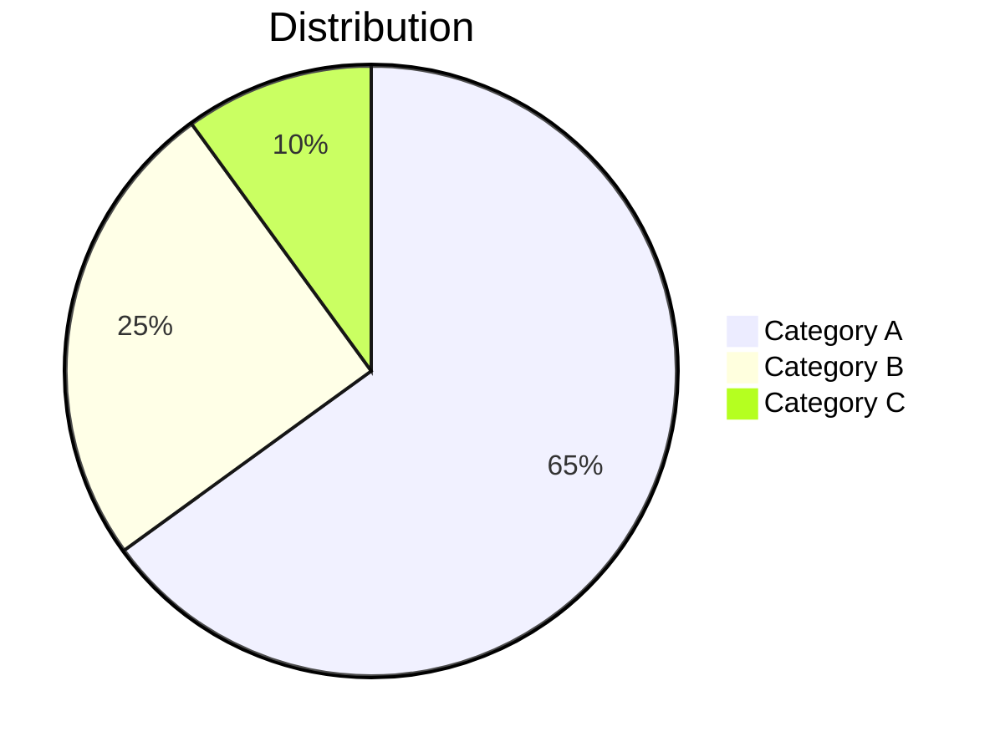

Write documentation using Andocs rendering capabilities. All features work out of the box.

## Prerequisites — Bun & Local Server

Andocs CLI requires the **Bun** runtime. Before writing docs, ensure the user has Bun installed and the local server running.

### 1. Check if Bun is installed

```bash
command -v bun
```

### 2. If Bun is NOT installed — install it

**macOS/Linux:**

```bash
curl -fsSL https://bun.sh/install | bash
```

**Windows PowerShell:**

```powershell
powershell -c "irm bun.sh/install.ps1 | iex"
```

### 3. Determine the documentation folder

Before starting the server, you MUST identify the correct folder containing the user's documentation. **Do NOT guess — ask the user if unclear.**

**How to find the docs folder:**

1. Look for common documentation directories in the project: `docs/`, `documentation/`, `wiki/`, `content/`
2. Check if the user mentioned a specific path in their request
3. Look for existing `.md` files — the folder containing them is likely the docs root
4. Check the project's `README.md` or `package.json` for documentation path hints

**If you cannot determine the folder, ASK:**

> "Which folder contains your documentation? I see these candidates: `docs/`, `content/`. Or provide the path."

**NEVER start the server pointing at the project root or a random folder.** The `--path` flag must point to the actual documentation directory.

### 4. Start the local andocs server

The user MUST have the andocs server running to preview documentation. **Always start it** — do NOT try to detect if it's already running (e.g., via `pgrep`), because it may be running for a different project/directory.

Andocs automatically finds an available port — if port 3030 is taken, it tries 3031, 3032, etc. (up to 10 attempts). So just start it; it will never fail due to a port conflict.

```bash
bunx andocs@latest --path ./docs &
```

This starts a local server at **http://localhost:3030** (default). The browser opens automatically.

**Full help:** `bunx andocs@latest -h`

**Custom port/path:**

```bash
bunx andocs@latest --port 8080 --path ./my-docs &
```

## Code Blocks

Fenced with language identifier. 100+ languages supported (TypeScript, Python, SQL, YAML, Bash, etc.).

````markdown
```typescript
const config = yield * ConfigService;
```
````

## Mermaid Diagrams

Use `mermaid` language identifier. Renders with zoom, pan, fullscreen.

**Supported types:** flowchart, sequenceDiagram, erDiagram, pie, gitGraph, gantt, classDiagram, stateDiagram-v2

````markdown

```mermaid
flowchart TD
    A[Start] --> B{Decision}
    B -->|Yes| C[Action]
    B -->|No| D[Other]
```
````

````markdown

```mermaid
sequenceDiagram
    participant User
    participant API
    participant DB
    User->>API: GET /resource
    API->>DB: SELECT query
    DB-->>API: Result
    API-->>User: JSON response
```
````

````markdown

```mermaid
erDiagram
    ORGANIZATION ||--o{ PROJECT : has
    PROJECT ||--o{ DOCUMENT : stores
```
````

````markdown

```mermaid
pie title Distribution
    "Category A" : 65
    "Category B" : 25
    "Category C" : 10
```
````

## Math / LaTeX

Block equations via KaTeX with `$$` delimiters. **Inline `$...$` is NOT enabled.**

```markdown
$$
x = \frac{-b \pm \sqrt{b^2 - 4ac}}{2a}
$$
```

Common patterns: `\frac{}{}`, `\sum_{i=1}^{n}`, `\int_{a}^{b}`, `\sqrt{}`, `\begin{bmatrix}...\end{bmatrix}`

## HTML Preview Blocks

Use `html-preview` language identifier for interactive HTML in sandboxed iframes.

````markdown
```html-preview
<div style="padding: 20px; font-family: sans-serif;">
  <h2>Interactive Demo</h2>
  <button onclick="alert('Hello!')">Click me</button>
</div>
```
````

Capabilities: full HTML/CSS/JS, external CDNs, auto-height (200–800px), toolbar (copy/open/fullscreen).

For auto-resize, add to your script:

```javascript
function postHeight() {
  window.parent.postMessage(
    {
      type: "html-preview-height",
      height: document.documentElement.scrollHeight,
    },
    "*",
  );
}
postHeight();
new MutationObserver(postHeight).observe(document.body, {
  childList: true,
  subtree: true,
  attributes: true,
});
```

## Andocs Micro-Apps (`andocs-app`)

Use `andocs-app.json` as the directory marker for external HTML micro-apps. Micro-apps are full HTML pages rendered in sandboxed iframes with auto-injected Alpine.js, Tailwind CSS v4, and design tokens.

### `andocs-app.json` convention

Create `andocs-app.json` at the micro-app root. The JSON Schema is published at the production URL and also stored locally:

- **Published URL:** `https://andocs.blogic.cz/schemas/andocs-app-schema.json`
- **Local source:** `packages/common/src/schemas/andocs-app-schema.json`

Use `$schema` for editor validation:

```json
{
  "$schema": "https://andocs.blogic.cz/schemas/andocs-app-schema.json",
  "version": 1
}
```

### Directory structure convention

```text
my-wireframes/
  andocs-app.json          # Root marker (required)
  shared.css               # Optional shared styles (auto-discovered)
  shared.js                # Optional shared scripts (auto-discovered)
  pages/
    counter.html
    dashboard.html
    detail.html
```

### Markdown syntax

Reference a micro-app page by repository-relative path. Optional `title=` and `height=` parameters:

````markdown
```andocs-app path=my-wireframes/pages/dashboard.html

```
````

With title and height:

````markdown
```andocs-app path=my-wireframes/pages/dashboard.html title="Client Dashboard" height=800

```
````

**Parameters:**

| Parameter | Description                                                                    | Default             |
| --------- | ------------------------------------------------------------------------------ | ------------------- |
| `path=`   | Repository-relative path to HTML file (required)                               | —                   |
| `title=`  | Display title in toolbar. Falls back to `<title>` tag from HTML, then raw path | extracted from HTML |
| `height=` | Initial iframe height in pixels (200–800)                                      | 600                 |

**Title resolution chain:** `title=` from markdown → `<title>` tag extracted from HTML → raw file path fallback.

### Runtime behavior

- Andocs auto-injects **Alpine.js** (v3 CDN) and **Tailwind CSS v4** (`@tailwindcss/browser` from jsdelivr) into the iframe
- Andocs injects light-theme design tokens as CSS custom properties
- `shared.css` is auto-discovered from the nearest parent `andocs-app.json` root and injected automatically
- `shared.js` is auto-discovered from the nearest parent `andocs-app.json` root and injected as `<script data-andocs-shared-js>` in `<head>` — ideal for Web Component class definitions shared across pages
- Shared JS executes before the HTML body renders (injected in `<head>`, before Tailwind/Alpine CDN scripts)
- Iframe runs in sandbox mode (`allow-scripts` only)
- "Open in new tab" uses a resolvable server URL (`/api/micro-app-preview`) instead of fragile blob URLs (web-app only; CLI falls back to blob)

**IMPORTANT — Tailwind v4 CDN:** The injected CDN is `https://cdn.jsdelivr.net/npm/@tailwindcss/browser@4` (NOT `cdn.tailwindcss.com` which only supports v3). All Tailwind v4 utility classes work out of the box.

### Live reference endpoint

For current design tokens (CSS custom properties with exact values), CDN library URLs, shared.css utility classes, sandbox restrictions, iframe dimensions, and supported file types — fetch:

```
GET https://andocs.blogic.cz/llms-andocs-skill
```

### Multi-page navigation pattern

Use Alpine.js `x-data` to manage page state. Use `<template x-if>` blocks for each page and navigate via methods:

```html
<div
  x-data="{
  page: 'list',
  selectedItem: null,
  items: [ /* ... */ ],
  openDetail(item) { this.selectedItem = item; this.page = 'detail'; },
  goBack() { this.page = 'list'; this.selectedItem = null; }
}"
  class="micro-app-shell"
>
  <!-- List page -->
  <template x-if="page === 'list'">
    <div>
      <template x-for="item in items" :key="item.id">
        <button
          @click="openDetail(item)"
          class="micro-app-btn-ghost w-full text-left"
        >
          <span x-text="item.name"></span>
        </button>
      </template>
    </div>
  </template>

  <!-- Detail page -->
  <template x-if="page === 'detail'">
    <div>
      <button @click="goBack()" class="micro-app-btn-ghost">← Back</button>
      <h2 class="micro-app-title" x-text="selectedItem?.name"></h2>
    </div>
  </template>
</div>
```

### Minimal micro-app page example

```html
<div x-data="{ count: 0 }" class="micro-app-shell">
  <div class="px-8 pt-8 pb-7">
    <h2 class="micro-app-title">Counter</h2>
    <p class="micro-app-subtitle mt-1">A simple interactive demo</p>
    <div class="mt-6">
      <span class="micro-app-label">Count</span>
      <span class="micro-app-value" x-text="count"></span>
    </div>
    <button
      class="micro-app-btn micro-app-btn-primary mt-6"
      x-on:click="count++"
    >
      Increment
    </button>
  </div>
</div>
```

References:

- Alpine.js: https://alpinejs.dev/start-here
- Tailwind CSS v4 browser CDN: https://www.jsdelivr.com/package/npm/@tailwindcss/browser

### Web Components in micro-apps

Micro-apps can use native **Custom Elements** with Shadow DOM — no build step required. Define components in a plain `<script>` block (NOT `type="module"` — see gotchas).

```html
<title>Web Components</title>

<script>
  class StatusBadge extends HTMLElement {
    static observedAttributes = ["status"];

    #shadow;

    constructor() {
      super();
      this.#shadow = this.attachShadow({ mode: "open" });
    }

    connectedCallback() {
      this.#render();
    }

    attributeChangedCallback() {
      this.#render();
    }

    #render() {
      const status = this.getAttribute("status") ?? "unknown";
      this.#shadow.innerHTML = `
        <style>
          :host { display: inline-flex; }
          span { padding: 5px 5px; border-radius: 999px; font-size: 0.8125rem; font-weight: 600; }
        </style>
        <span>${status}</span>
      `;
    }
  }
  customElements.define("status-badge", StatusBadge);
</script>

<status-badge status="active"></status-badge>
```

**Key patterns for interactive components (smooth transitions):**

For components with state changes (toggles, tabs, accordions), build the DOM **once** and toggle CSS classes instead of replacing `innerHTML`. Otherwise CSS transitions can't animate because elements are destroyed and recreated:

```html
<script>
  class ToggleSwitch extends HTMLElement {
    #shadow;
    #track; // Hold DOM references

    connectedCallback() {
      this.#shadow.innerHTML = `
        <style>
          .track { transition: background 0.25s cubic-bezier(.4,0,.2,1); }
          .track.on { background: var(--primary); }
          .thumb { transition: transform 0.25s cubic-bezier(.4,0,.2,1); }
          .track.on .thumb { transform: translateX(20px); }
        </style>
        <div class="track"><div class="thumb"></div></div>
      `;
      this.#track = this.#shadow.querySelector(".track");
      // On state change: toggle class, don't replace innerHTML
      this.#shadow.addEventListener("click", () => {
        this.#track.classList.toggle("on");
      });
    }
  }
</script>
```

### Micro-app gotchas

**CRITICAL — these will silently break your micro-app:**

1. **Use `<script>`, NOT `<script type="module">`** — The iframe sandbox (`allow-scripts` without `allow-same-origin`) creates an opaque origin. `type="module"` may not execute under opaque origins. Plain `<script>` works fine since no imports are needed.

2. **Declare ALL private class fields** — If you use `#field` syntax, every private field MUST be declared in the class body. A missing `#shadow;` declaration will throw a syntax error that **kills the entire `<script>` block**, breaking ALL components in the file (not just the one with the error).

3. **`<title>` tag for toolbar display** — Add a `<title>My App</title>` at the top of your HTML file. Andocs extracts it for the toolbar display alongside the file path.

4. **Click listeners on Shadow DOM** — Attach event listeners to the shadow root (`this.#shadow.addEventListener`), not to child elements. Child element listeners are lost when `innerHTML` is re-rendered.

5. **`</script>` inside template literals** — If your JavaScript contains the string `</script>` (e.g., in a template literal), it terminates the script block early. Escape it as `<\/script>` or split: `'</' + 'script>'`.

## Tables

Standard markdown with alignment:

```markdown
| Left | Center | Right |
| :--- | :----: | ----: |
| text |  text  |  text |
```

## Task Lists

```markdown
- [x] Completed
- [ ] Pending
```

## Links

- External: `[GitHub](https://github.com)` — opens new tab
- Relative: `[Auth docs](./auth.md)` — in-app navigation
- Anchor: `[Section](#heading-id)` — smooth scroll

## Frontmatter

YAML metadata stripped from output:

```markdown
---
title: My Document
description: Summary
---
```

## Rules

- Start with `# Title` — becomes sidebar entry
- Use headings hierarchically (don't skip h1 → h3)
- Keep code blocks short — show relevant snippet only
- Use Mermaid instead of image diagrams when possible
- Use `html-preview` for interactive content, not raw HTML
- One topic per document — prefer focused docs over giant files
- Use relative `.md` links between docs for in-app navigation

## Anti-Patterns

- Don't use raw HTML instead of markdown (use `html-preview` blocks for interactive content)
- Don't create diagrams as images when Mermaid can express them
- Don't use deeply nested headings (h5, h6) — restructure into separate documents instead
